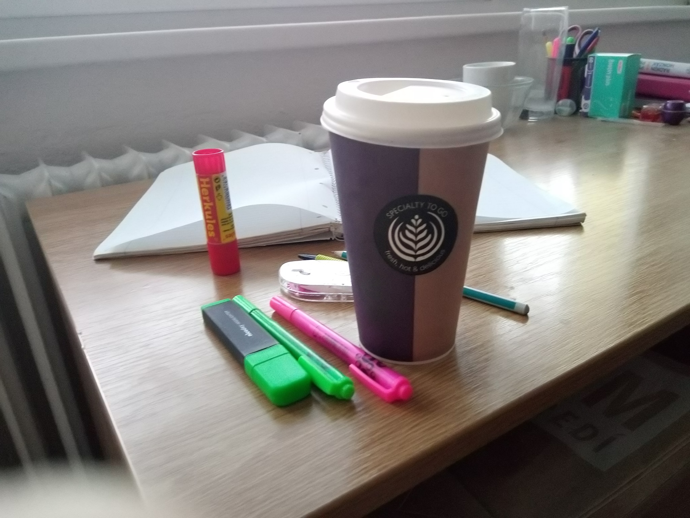

--- 
title: Největší nepřítel cosplayera ?? Prokrastinace 
date: 2019-05-14 
--- 
 
    Asi každý z nás už sledoval svůj oblíbený seriál nebo anime se zatajeným dechem a naprostým nadšením pro určitou postavu. A jakmile film nebo epizoda seriálu skončí člověk začne okamžitě googlit fotografie nebo obrázky svého nově objeveného vzoru. V hlavě si začnete přehrávat scénáře a své oblíbené scény ve vašem novém cosplayi. Jenomže pak přejde týden, měsíc a vaše velké sny skončí pouze u plánů. Proto vám tu uvedeme několik typů jak míru prokrastinace snížit, protože zcela vymýtit ji z života cosplayera zkrátka nejde tak hodně zdaru. 

    1) Buďte si jistí vaší postavou
    Aneb sedněte si a zamyslete se inspiruje mě tato postava dostatečně na to abych do ní investoval čas a peníze?? Nechte si to projít hlavou. Pokud si budete postavou na 100% jistí zvýšíte tak své nadšení a to vám pomůžeke snížení prokrastinace v dalších fázích.

    2)Vytvořte si pevný plán
    Pokud už máte svou spřízněnou postavu, může začít opravdová zábava a to vytváření plánu. Projděte fotografie a obrázky své postavy ze všech možných i nemožných úhlů a ty překteslete nejlépe ručně. Nemusíte být Picasso, stačí aby na obrázku jste si rozkreslily jenotlivé části a začali o nich detailně přemýšlet.

 

    3) Hledejte materiály
    Teď už stačí pouze shánět materiály co nám poslouží při výrobě a nebojte se ne vše se vám povede na první pokus. V této části doporučuji hodně kávy a příjemnou muziku. A jedna dobrá rada cosplay se sice dá složit za 12 hodin před akcí na kterou ho připravujete, ale garantuji vám že vás to bude stát krev, pot a slzy. Tak svou práci nenechávejte na poslední chvíli.  

 

