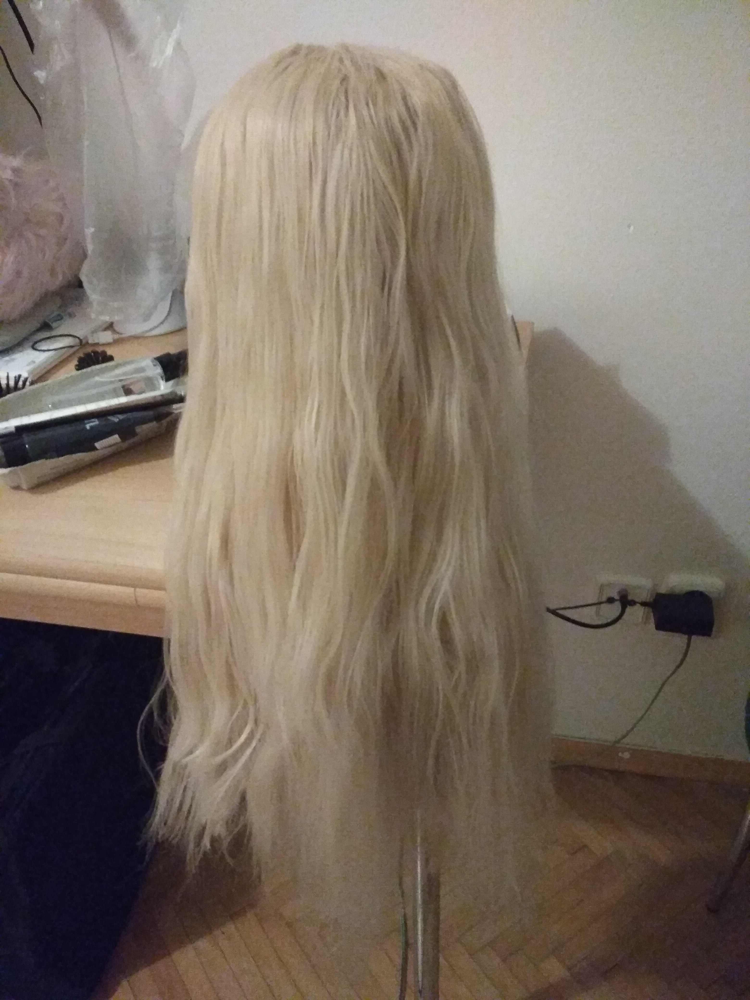
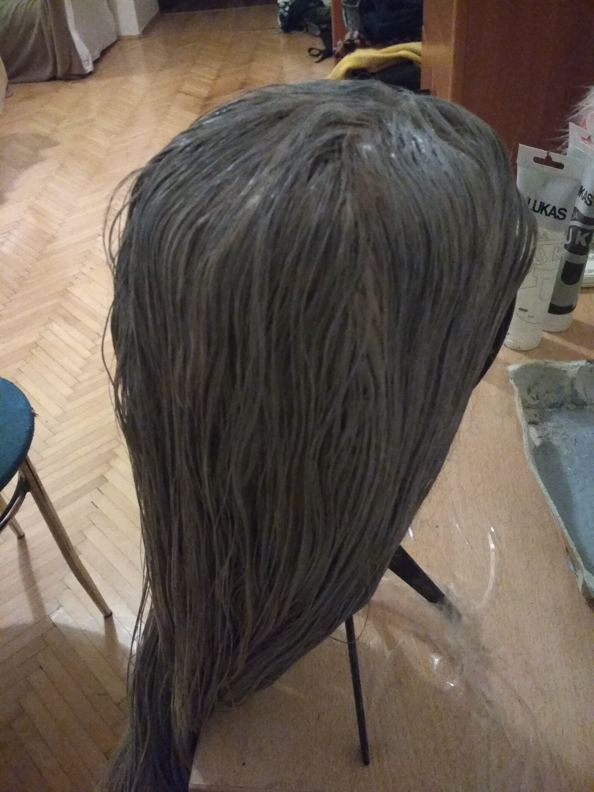
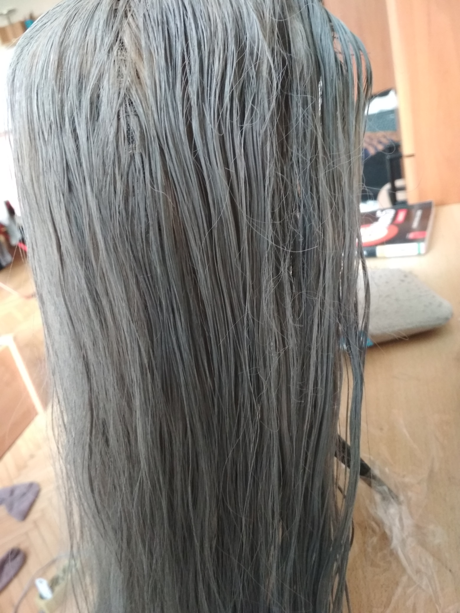

---
title: Obarvení paruky pomocí akrylových barev
date: 2019-05-13
---
Ne vždy má cosplayer přirozenou délku nebo i barvu vlasů pro vytvoření zvoleného charakteru. To se dá, ale velmi jednoduše dohnat za pomocí paruky. Na trhu existují paruky všemožných barev, hustot a délek. Výběr vysněné paruky může, ale velmi zasáhnout do našich financí. My vám chceme tedy ukázat způsob jak si vytvořit paruku potřebné barvy a nezruinovat si při tom peněženku. 

#### Co k tomu budete potřebovat:

**Paruka** – nejlépe blond (čím světlejší, tím lepší), kvalitu necháme na vás, 
¨            ale výhodou akrylových barev je to, že paruku zbaví nepřirozeného 
             lesku, takže i levná paruka za pár korun nebude vypadat dobře

**Akrylová barva** – odstín i značka barvy je plně na vás, akrylovou barvu 
                     většinou najdete v každých výtvarných potřebách nebo v papírnictví

**Rozprašovač s vodou** – super pomocník pro lepší vsakování barvy do vlasů

#### Instrukce:

- Barvu je potřeba naředit do požadovaného odstínu vodou, tou rozhodně 
  nešetřete, čím více vody tím lépe.
- Jakmile máte barvu připravenou můžete začít. *Paruku je fajn navlhčit 
  rozprašovačem a v průběhu rozčesávat aplikovanou barvu.*
- Nechat přes noc nebo pár hodin pořádně uschnout. 
- Paruka jakoby “zdredovatí”, což naprosto v pohodě a normální. 
- Finální krok je ji pořádně rozčesat, což zabere celkem dost času, ale 
  výsledek stojí za to. 
- Funguje na kompletní změnu barvy (lepší ztmavovat jako u normálních vlasů) 
  nebo jen na “dotónování”. Nerovnoměrnost barvy není na škodu, vytváří přirozenější efekt melíru.

    
