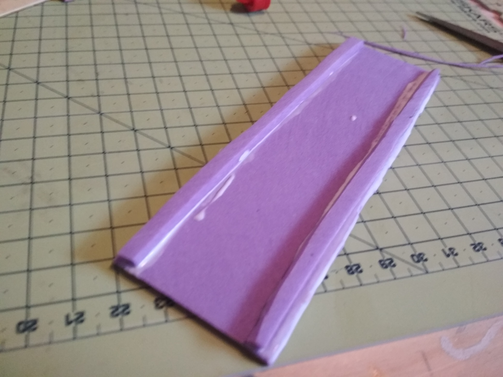
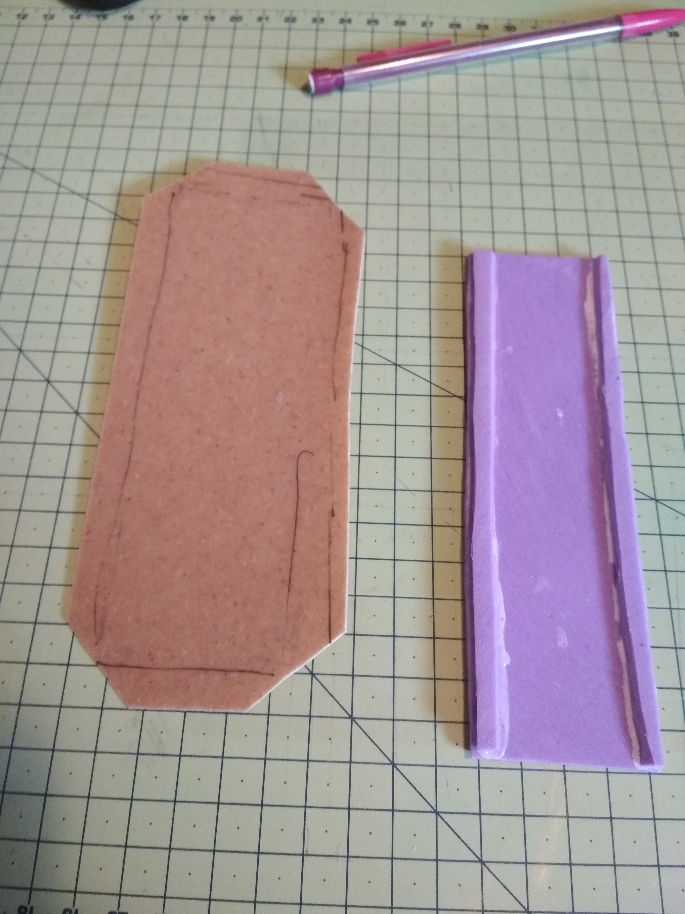
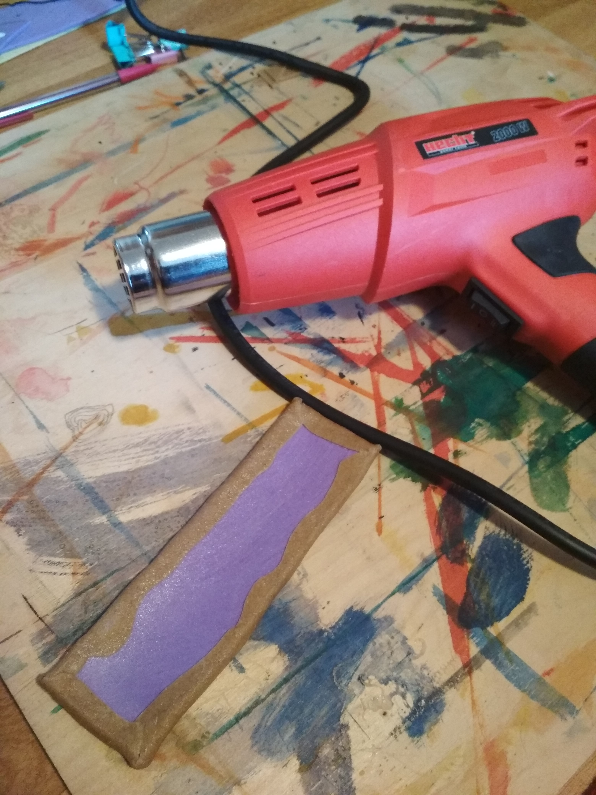
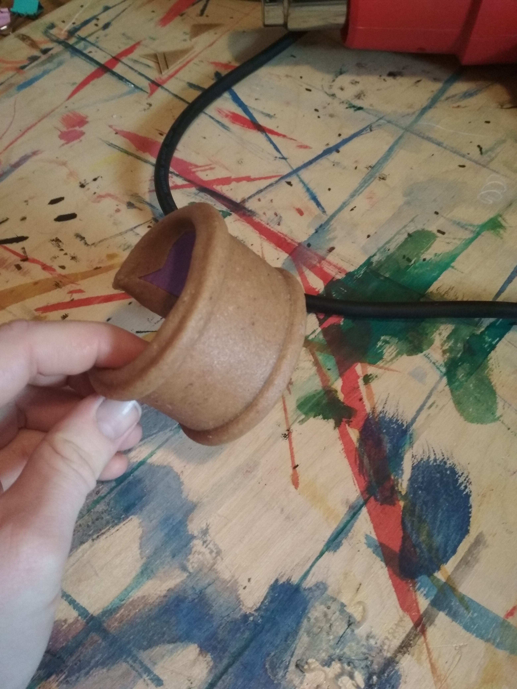
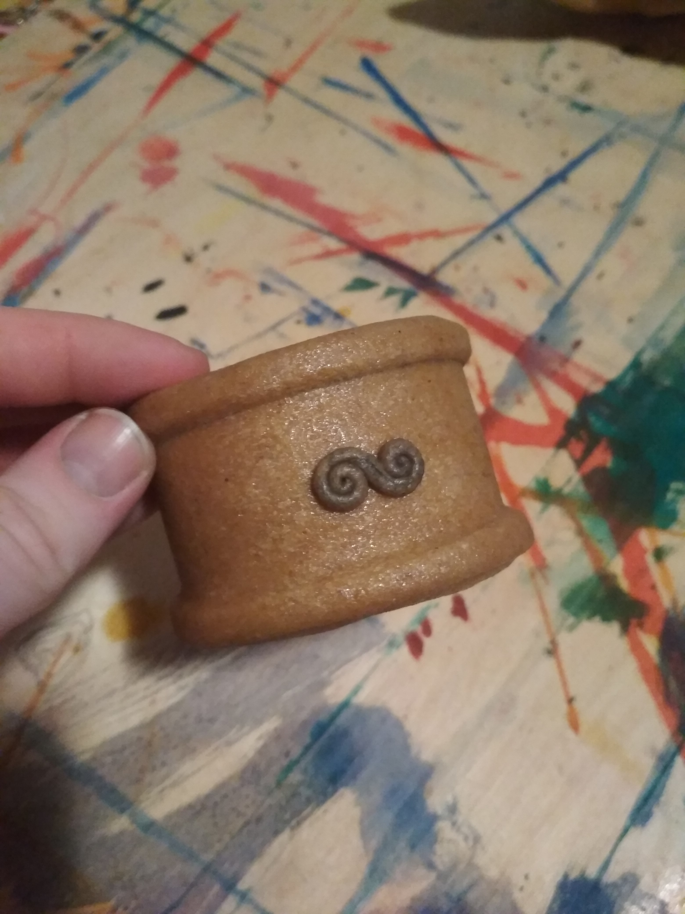

Worbla je naprosto kouzelný materiál, který nebudu zbytečně dlouho představovat, jelikož se článek bude zabývat hlavně použitím, nikoli historií. Jediné, co je dobré vědět je, že jde o termoplast a společně s worblou je dobrý nápad si pořídit i **horkovzdušnou pistoli**, která z tuhého materiálu vytvoří poddajnou a tvárnou hmotu. 
Kromě **worbly** a pistole je třeba něco na výplň, já použila **kus tenké gumové pěny**, která se dá sehnat v běžných výtvarných potřebách.
Z oné gumy jsem si vystřihla obdélník požadovaných rozměrů. Vzhledem k tomu, že chci, aby byl těsně na ruku a nikoli volný, odpadá možnost jednoduchého přetažení přes zápěstí. Nechala jsem ho tedy vzadu nespojený s mezerou asi 2–3 centimetry. 
Na delší kraje plochy gumy jsem obyčejným herkulesem nalepila dva tenké proužky (opět z gumy), což je jen osobní preference a taky snaha, aby to na pohled nebyla jen nudná placka. 

Teď přichází na řadu konečně worbla, na kterou jsem si obkreslila gumový obdélník a přidala asi tak půl centimetru, které se založí dozadu. Zůstane mi tedy většina zadní strany worblou nepokrytá, což mi ale v ničem nevadí protože za a) na ruce to nebude vidět a za b) worbla je celkem drahá a plýtvat s ní rozhodně nehodlám. 

Čas zapojit pistoli. Worblu jsem nahřála dokud lehce neztmavla a na dotek nebyla hezky teplá a měkká. Následovalo přiložení na gumový základ a uhlazování kolem proužků, aby hezky vynikly. Dala jsem si záležet, aby nevykukovaly rohy a zadní strana byla uhlazená co nejvíc doztracena. V téhle části je většinou potřeba si worblu znova nahřát a začít tvarovat na ruku. Tvarovala jsem rovnou na ruce, aby mi co nejlíp náramek seděl, ale pozor!! Buď se ujistěte, že worbla není moc horká, protože hrozí nebezpečí popálení nebo modelujte na něčem, co rozměrově odpovídá zamýšlenému výsledku. 

Z odstřižků worbly jsem si ještě vymodelovala tenkou šňůru, stočila a ozdobila jí náramek. Při “dolepování” je dobré nahřát oba dva povrchy, lépe k sobě přilnou.

Worbla se dá samozřejmě i malovat, já většinou volím akrylové barvy (hlavně kvůli dostupnosti), ale předpokládám, že se dá použít téměř cokoli. Jen pozor na výraznou poréznost worbly,  se kterou se dá samozřejmě také vypořádat. O tom ale někdy jindy. 

**Tip na konec**: pokud vám worbla udělá vzduchovou bublinku, stačí ji propíchnout, vytlačit vzduch a uhladit.
